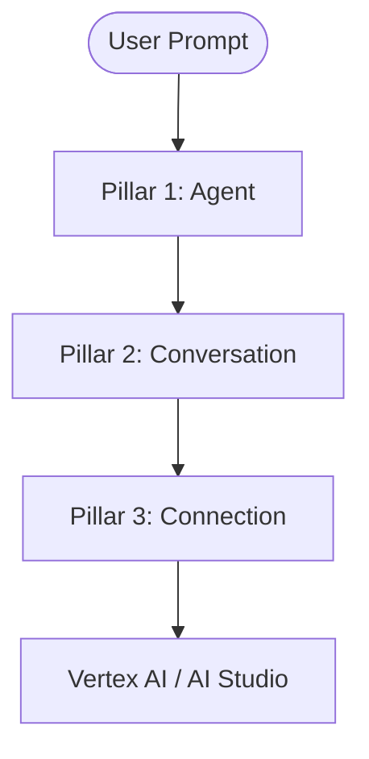

# 🪐 Google Antigravity: Official Architecture & Developer Docs

Welcome to the comprehensive developers documentation for **Google Antigravity**, the next-generation agentic AI framework for constructing stateful, multi-agent systems and tooling pipelines.

---

## 🏛️ Core Architecture: The Three Pillars

Google Antigravity SDK abstracts complex LLM coordination, context management, and transport structures into three distinct pillars:



### 1. The `Agent`
The high-level orchestrator. It manages structural properties such as the system prompt (persona), model selection, custom python tool registries, cost budgets, and safety policies.
* **Key Class**: `google.antigravity.Agent`
* **Configuration**: `google.antigravity.LocalAgentConfig`

### 2. The `Conversation`
The state coordinator. It manages session variables, accumulates and serializes conversation history turns, tracks active tool calls, and performs automatic context compaction when nearing limits.
* **Key Class**: `google.antigravity.Conversation`
* **Lifecycle**: Generated automatically when an agent session begins.

### 3. The `Connection`
The transport layer. It encapsulates payload formatting, handles raw token requests, and parses model streams. It decouples your agent definitions from regional API endpoints (e.g. EU vs. US) and credentials setup.

---

## 🔌 Setup & Installation Guide

To configure Antigravity locally on your laptop, follow these terminal instructions:

### 1. Base Installation
Initialize a virtual environment and install the required packages:
```bash
python3 -m venv venv
source venv/bin/activate
pip install google-adk google-genai dotenv
```

### 2. PEP 420 Namespace Rule
> [!IMPORTANT]
> The SDK uses a shared `google` package namespace. To avoid blocking access to other Google libraries:
> * **Never** add an `__init__.py` file directly inside the root `google/` folder.
> * Enable execution permissions for the local helper binary:
>   ```bash
>   chmod +x google/antigravity/bin/localharness
>   ```

### 3. Configure local CLI
Install shell path configurations and autocomplete scripts:
```bash
agy install
```

---

## ⚙️ Local Agent Configuration

Configure agents by defining settings inside the `LocalAgentConfig` object:

```python
from google.antigravity import Agent, LocalAgentConfig

config = LocalAgentConfig(
    model="gemini-2.5-flash",
    system_instructions="You are a helpful database administrator.",
    app_data_dir="/Users/user/project/storage" # Overrides default telemetry paths
)
```

---

## 🛠️ Custom & Stateful Tools

Tools are standard Python functions that the LLM runs autonomously. 

### 1. Basic Tool Definition
Your tool functions **must** contain detailed docstrings detailing parameter names, descriptions, and return types:

```python
def check_server_ping(host: str) -> str:
    """Checks the latency of a remote server host.

    Args:
        host: The server domain or IP address, e.g., "google.com".
    """
    return f"Ping to {host} is 12ms (Healthy)."
```

### 2. Stateful Tooling with `ToolContext`
To maintain variables across multiple turns (e.g. inventory counters, shopping carts), declare a `ToolContext` parameter in your function. The SDK will inject this context automatically during tool execution:

```python
from google.antigravity import ToolContext

def increment_database_counter(by: int, ctx: ToolContext) -> str:
    """Increments the write count in conversation state database.

    Args:
        by: Number of units to add to database.
        ctx: Context injector (system parameter, do not specify in prompt).
    """
    # Retrieve state dictionary
    state = ctx.get_state("db_metrics", {"writes": 0})
    
    # Update state
    state["writes"] += by
    ctx.set_state("db_metrics", state)
    
    return f"Database writes: {state['writes']}."
```

---

## 🛑 Safety Policies & Predicates

Safety policies intercept agent runs to enforce restrictions and filter illegal commands:

```python
from google.antigravity import Agent, LocalAgentConfig
from google.antigravity.hooks import PreTurnHook

class CommandFilterHook(PreTurnHook):
    async def pre_turn(self, prompt: str) -> str:
        # Enforce policy checks before passing the turn to the model
        if "rm -rf" in prompt:
            raise PermissionError("Destructive commands are forbidden.")
        return prompt
```

---

## 📊 Observability & Cost Tracking

Telemetry data (tokens used, reasoning steps, latencies) is captured automatically and stored locally under `~/.gemini/antigravity/brain/<session_id>/`.

You can inspect:
- **`task.md`**: The runtime TODO tree of planned actions.
- **`session.db`**: An SQLite registry tracking conversation turns, prompts, and tool output history.
